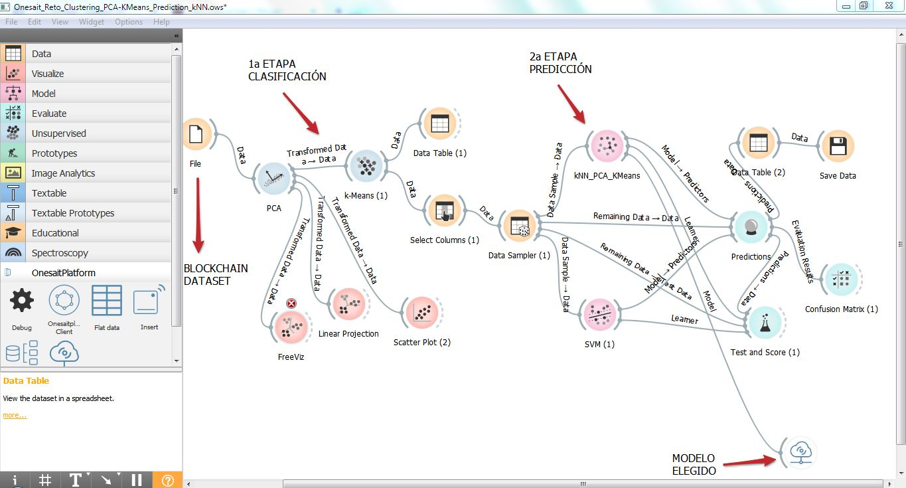
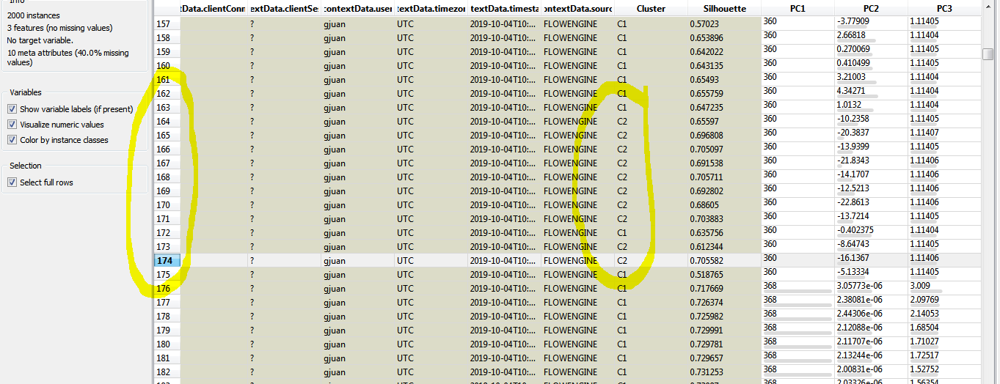
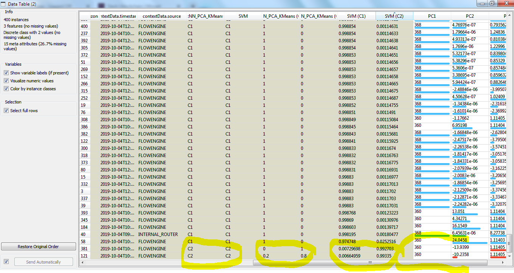

# OrangeBi workflows

Orange Biolab is a datamining tool easy to use and very powerful to gain insights and prototyping. 
In a few minutes you can build a complete model for training and testing a large list of Machine Learning algorithms.

An example of blockchain transactions classification is shown below:

  

## Ontologies (workflow's origin/destination)

With Onesait platform library for OrangeBi you can connect to a previously created ontology (see blockchain service) 
and extract blockchain transactions ready to be proccesed by the workflow.

Once the data flows to the last widgets in the workflow, the results can be exported to a new ontology 
in order to be presented in a dashboard or for further manipulation in a notebook.

You can use csv export files as origin for data preprocessing if necessary, and export OrangeBi results in csv format 
ready to import to a new ontology too.

## How it looks like?

With the workflow shown and the dataset eth_mainnet_transactions.tab extracted from a blockchain ontology you can see some curiosities:

* dataset: 2000 transactions
* training set: 80% (1600 transactions)
* testing set: 20% (400 transactions)
* PCA-KMeans (default values): Two clusters, C1 & C2
* Ten instances in C2 cluster, like a burst:

  

* kNN predictions: 2 of 400 transactions on cluster C2

  

## Next steps

At this very moment we don't know what clusters C1-C2 means, we only know that there are differrences enough between transactions belonging to cluster C1 and C2 so we can mark them out and predict those marks on new transactions. 

Next steps would be investigate those differences and determine their meaning. 

Using larger datasets (about millions of transactions), modifying algorithm's parametrization and deeper analysis of features (input columns) will reveal new clusters and interesting behaviors for sure.

Enjoy!
